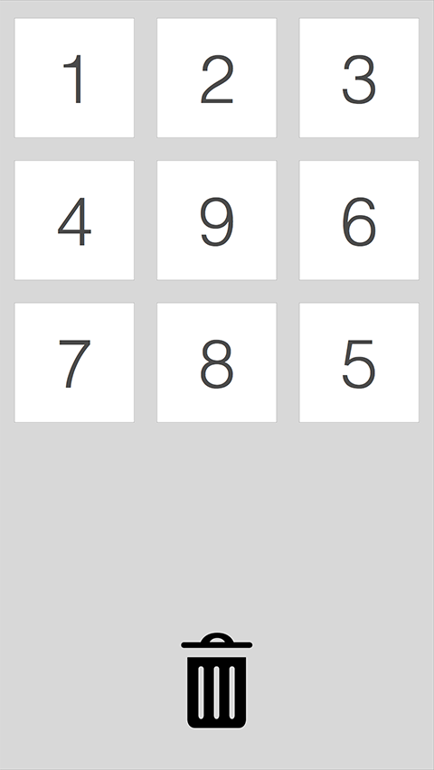
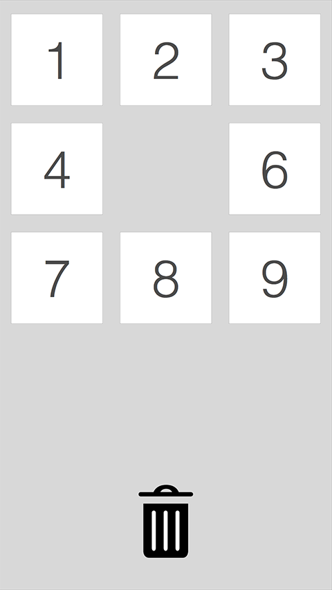

# thirteen23 iOS Exercise

## Instructions
Create a simple app that contains a grid of images based on the below specification. Your submission will be judged on both user experience and code quality.

## Requirements / Restrictions
- Use proper git procedures and link us to the repository (Github, Bitbucket, etc…)
- Do not use any third party libraries.
- Do not use storyboards or xibs. Everything should be built programmatically.
- Use your own best judgment on how to creatively handle any edge cases, design or UX not addressed in the specification.
- Assume you are delivering the source code to a client.

## Specifications
The wireframe below demonstrates all of the necessary UI elements. The trash can images can be found in the images directory.

- You must download and persist nine images and their positions in the grid.

- To get the image urls...
    - Hit https://t23-pics.herokuapp.com/pics for an array of image ids
    - Hit https://t23-pics.herokuapp.com/pics/{id} to get each image's
      url
      
- If there are no images downloaded, you must show a button, when clicked your app will download all of the images.
- Do not show the image grid until all the images are loaded.
- Give us feedback if the images are in order
- The images in the grid are dragable and can be moved into different grid positions. If a position is already occupied, the images are swapped.
- Touching an image and moving over the trash can and releasing will delete the image completely.
- If you delete an image, the grid will not reshuffle to fill the empty space.
- Any errors should be handled gracefully and notify the user where appropriate

###Layout

###Layout with missing image

## Caveats
Images are hosted on S3 for more information about this issue, see:
http://mobile.awsblog.com/post/Tx2QM69ZE6BGTYX/Preparing-Your-Apps-for-iOS-9

